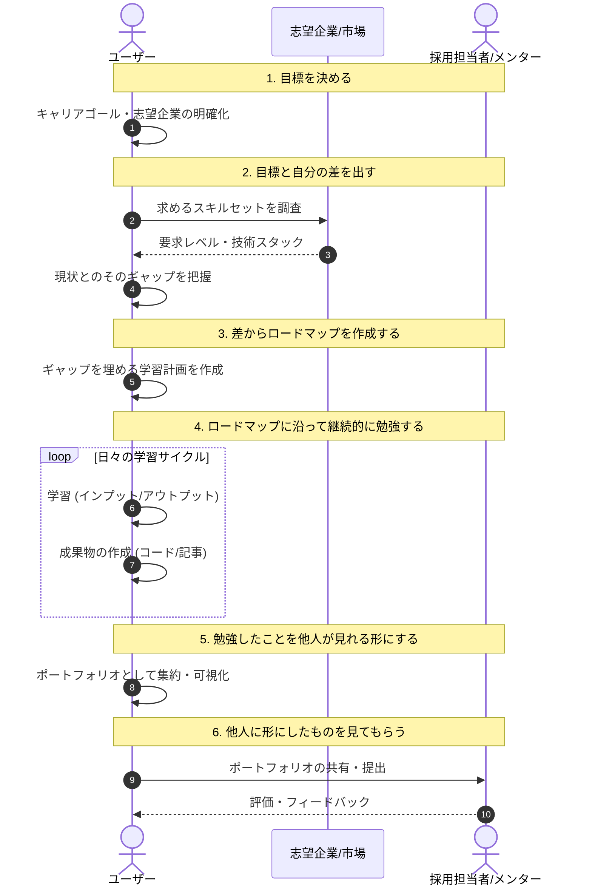

# 課題深掘り分析: LogFo 開発の背景

## 目標達成の標準フロー （就活時のフローを想定）

ユーザーが理想とする「目標達成（良い企業への入社）」までのプロセスは、以下の 6 ステップで構成されます。

1.  **目標を決める:** 自身のキャリアゴールや志望企業を明確にする。
2.  **目標と自分の差を出す:** 目標企業の要求レベルと、現在の自身のスキルセットのギャップを定量的に把握する。
3.  **差からロードマップを作成する:** ギャップを埋めるための具体的な学習計画やアクションリストを作成する。
4.  **ロードマップに沿って継続的に勉強する:** 計画に基づき、インプットとアウトプット（コーディング、記事執筆など）を繰り返す。
5.  **勉強したことを他人が見れる形にする:** 学習の成果（コード、記事、活動ログ）をポートフォリオとして可視化する。
6.  **他人に形にしたものを見てもらう:** 採用担当者やメンターにポートフォリオを共有し、評価やフィードバックを得る。

### 目標達成シーケンス (Sequence Diagram)

---

本ドキュメントでは、LogFo 開発の起点となる「ユーザー（自身）が抱える課題」を分析し、なぜその課題が発生しているのか（深掘り）、そして LogFo がどう解決するのかを整理します。

## 1. 抱えている課題 (Problems)

ユーザーは「目標企業への入社」というゴールを持っていますが、そこに至るプロセスで以下の 4 つの主要な課題に直面しています。

### (1) 学習モチベーションの維持困難 (Sustaining Motivation)

- **現状:**
 - プログラミングやソフトウェア関連の勉強を始めても、モチベーションが長続きせず、中断してしまうことがある。
- **深掘り（Why?）:**
 - **進捗の不可視性:** 日々の学習活動（記事執筆、読書）が蓄積として可視化されにくく、「前に進んでいる」という感覚（Sense of Progress）が得にくい。
 - **フィードバックの欠如:** 勉強しても即座に誰かから反応があるわけではなく、孤独な作業になりがちであるため、内発的動機付けが枯渇しやすい。

### (2) 目標企業とのスキルギャップの不明瞭さ (Unclear Skill Gap)

- **現状:**
 - 目標としている企業（LayerX, Plaid, Sansan など）と、現在の自身のレベルにどれだけの差があるかが分かっていない。
 - 何をどれくらい勉強すればそこに到達できるのかが明確でない。
- **深掘り（Why?）:**
 - **定性的な憧れ:** 「レベルが高い」という認識はあるが、「具体的にどの技術スタックを、どの程度の深さで、どのくらいの量（活動量）こなしているのか」という定量的な基準がない。
 - **ロードマップの不在:** ギャップ（差分）が見えないため、そこを埋めるための具体的なアクションプラン（ロードマップ）に落とし込めず、今日何をすべきかが曖昧になり、やる気が出ない。

### (3) アウトプット共有・証明のコスト (High Reporting Cost)

- **現状:**
 - 今までやってきた学習やアウトプットを、企業の人やメンターに共有するために、いちいちスライドや Notion 等にまとめる作業が発生する。
- **深掘り（Why?）:**
 - **データの散逸:** 「GitHub にはコード」「Zenn には記事」「WakaTime には時間」と、努力の証跡が分散している。
 - **手動集約の手間:** これらを一つのストーリーとして見せるための「ポートフォリオ作成」自体が重たい作業になってしまい、本来の学習時間を奪う、または億劫で共有しなくなる。

### (4) 相対的な立ち位置の喪失 (Lack of Relative Standing)

- **現状:**
 - 他のエンジニアやライバルがどれくらいコミットし、勉強しているのかが分からない。
 - 自分の現在の立ち位置（マーケットバリューや相対評価）が掴めない。
- **深掘り（Why?）:**
 - **ブラックボックス化:** 優秀なエンジニアの「完成品」は見えるが、「裏側での泥臭い学習量や試行錯誤」は見えないため、基準値を低く見積もってしまったり、逆に過度な不安を感じたりする。
 - **健全な競争心の不在:** 「あの人もこれだけやっているから自分もやろう」というライバル意識や、客観的な比較指標がないため、モチベーションのドライブがかかりにくい。

---

## 2. 解決の方向性 (Solution Direction)

上記の深掘りから、LogFo が提供すべき価値（Value Proposition）は以下のようになります。

| 課題カテゴリー     | 解決のアプローチ                 | 具体的な機能イメージ                                                       |
| :----------------- | :------------------------------- | :------------------------------------------------------------------------- |
| **モチベーション** | **可視化** | 学習ログの自動収集、日々の継続記録                             |
| **スキルギャップ** | **定量的ベンチマーク**           | 目標企業のエンジニアの活動量・技術スタックの可視化、自分との差分表示       |
| **共有コスト**     | **ポートフォリオ自動生成**       | API 連携で集約したデータを基に、証明力のあるポートフォリオページを自動生成 |
| **立ち位置**       | **相対指標の提示**               | 同選考志望者や同年代エンジニアとの活動量比較、ランキング（任意）           |

