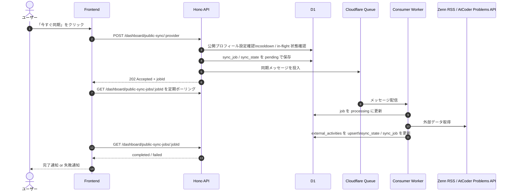

# 公開データ同期機能 詳細設計書 (Public Activity Sync Design)

この設計書は、Zenn と AtCoder の公開データを LogFo に安全に取り込み、ダッシュボードへ反映するための非同期同期機能を定義する。
GitHub / WakaTime のような OAuth ベースの同期とは性質が異なるため、既存の `POST /dashboard/sync/:provider` とは別系統の仕組みとして扱う。

## 1. 設計時に注意した観点

この機能は、単に外部データを取得できればよいものではない。
設計時には、特に以下の 2 点を重視した。

### 1.1. 相手サービスへの負荷軽減を最優先にする

Zenn も AtCoder も、LogFo 向けに安定契約された公式 API を提供しているわけではない。
そのため、LogFo 側の都合で高頻度にアクセスする設計は避け、**アクセス頻度・同時実行数・再試行の仕方を明示的に制御する**ことを最優先にする。

この設計では、以下の考え方を採用する。

- リクエスト経路で外部取得を実行しない
- Queue を使って処理を非同期化する
- 同時実行数とバッチサイズを小さく固定する
- cooldown を設け、ユーザーの連打による再取得を防ぐ
- 一時障害時も待機付きで再試行し、短時間に再アクセスしない

### 1.2. 非同期でも LogFo ユーザーの体験を損なわない

負荷軽減を優先して同期を非同期化すると、ユーザーには「押したあと何が起きているか分からない」状態が発生しやすい。
そこで、LogFo 側では**受付・進行・完了・失敗を状態として明示し、ユーザーが待ちぼうけにならない設計**を採用する。

この設計では、以下を満たすことを重視する。

- ボタン押下直後に受付完了を返す
- 同期中であることを UI で確認できる
- 完了時に画面上で通知できる
- 失敗時に理由を把握し、再実行へ戻せる

### 1.3. Cloudflare Workers の制約に収まる構成にする

Cloudflare Workers は、長時間処理や外部依存の重い同期をリクエスト経路で抱えるのに向かない。
そのため、Queue と D1 を組み合わせて、タイムアウト・再試行・状態管理に耐えられる構成にする。

対象プロバイダーは以下の 2 つとする。

- **Zenn**: RSS フィード経由で公開記事を取得する
- **AtCoder**: AtCoder Problems API 経由で提出データを取得する

## 2. 全体フロー

### 2.1. ボタン押下から通知までの流れ



### 2.2. ユーザー体験の基本方針

- ボタン押下直後は**処理完了を待たずに** `202 Accepted` を返し、即時に「受付完了」を表示する
- フロントエンドは `jobId` を使って数秒おきに状態取得 API を叩き、完了時にトーストやステータス表示を更新する
- `pending` / `processing` 中は同一プロバイダーの再実行ボタンを無効化する
- `failed` の場合は失敗理由を UI に表示し、再実行可能な状態へ戻す

## 3. 使用技術と実装方法

| 実装項目 | 技術 | 実装方法 | 注意点 |
| :--- | :--- | :--- | :--- |
| 公開プロフィール設定 | Hono + D1 | `user_public_sources` に `provider` ごとのアカウント名を保存 | OAuth 情報と混在させない |
| 同期受付 | Hono + D1 + Queue | API で設定確認、状態確認、job 作成、Queue 投入を行う | `in-flight` と cooldown を必ず先に確認する |
| バックグラウンド処理 | Cloudflare Queues | Queue Consumer が外部取得と D1 更新を担当する | リクエスト経路で外部取得しない |
| 実行制御 | Cloudflare Queues | `max_concurrency = 1` と `max_batch_size = 1` を設定する | 1 consumer でもバッチが大きいと外部アクセスが密になるため、バッチサイズも固定する |
| 状態管理 | D1 | `external_sync_jobs` と `external_sync_states` でジョブ履歴と現在状態を分離する | Queue は at-least-once delivery のため idempotent にする |
| 同期結果保存 | D1 (`external_activities`) | `(user_id, provider, date)` 単位で upsert する | unique 制約を前提にする |
| 完了通知 | フロントエンドのポーリング | `GET /dashboard/public-sync-jobs/:jobId` を 3〜5 秒間隔で取得する | 初期実装は polling を採用し、将来的に Durable Objects + WebSocket へ拡張可能な形にする |
| 失敗隔離 | Cloudflare Dead Letter Queue | 規定回数リトライ後は DLQ へ送る | 根本障害と一時障害を分けて観測する |

## 4. API 設計

### 4.1. 公開プロフィール設定 API

- **エンドポイント:** `PUT /dashboard/public-sources/:provider`
- **対象:** `zenn`, `atcoder`
- **リクエスト例:**

```json
{
  "accountName": "riku"
}
```

- **役割:**
  - ユーザーごとの公開アカウント名を保存する
  - Zenn はユーザー名、AtCoder はユーザー ID を保存する

### 4.2. 同期受付 API

- **エンドポイント:** `POST /dashboard/public-sync/:provider`
- **対象:** `zenn`, `atcoder`
- **レスポンス例:**

```json
{
  "jobId": "job_123",
  "status": "pending"
}
```

- **処理内容:**
  1. `user_public_sources` に対象プロバイダーの設定があるか確認する
  2. `external_sync_states` を参照し、cooldown 中なら `429` を返す
  3. 同一 `user_id + provider` に `pending / processing` があれば `409` を返す
  4. `external_sync_jobs` に `pending` を作成する
  5. Queue に同期メッセージを投入する
  6. `202 Accepted` を返す

- **返却ステータス:**
  - `202`: 受付成功
  - `404`: 公開プロフィール未設定
  - `409`: すでに同期中
  - `429`: cooldown 中

### 4.3. 同期状態取得 API

- **エンドポイント:** `GET /dashboard/public-sync-jobs/:jobId`
- **レスポンス例:**

```json
{
  "jobId": "job_123",
  "provider": "zenn",
  "status": "completed",
  "syncedItemCount": 12,
  "lastErrorCode": null,
  "lastErrorMessage": null,
  "requestedAt": "2026-04-11T05:00:00.000Z",
  "completedAt": "2026-04-11T05:00:08.000Z",
  "nextSyncAvailableAt": "2026-04-12T05:00:08.000Z"
}
```

## 5. データ設計

### 5.1. `user_public_sources`

公開プロフィール設定を保持するテーブル。

- `id`
- `user_id`
- `provider`
- `account_name`
- `is_enabled`
- `created_at`
- `updated_at`
- `unique(user_id, provider)`

### 5.2. `external_sync_jobs`

同期ジョブの履歴を保持するテーブル。

- `id`
- `user_id`
- `provider`
- `source_type` (`public`)
- `status` (`pending | processing | completed | failed`)
- `cursor`
- `requested_at`
- `started_at`
- `completed_at`
- `synced_item_count`
- `last_error_code`
- `last_error_message`

### 5.3. `external_sync_states`

現在状態と次回同期可能時刻を保持するテーブル。

- `user_id`
- `provider`
- `source_type`
- `last_succeeded_at`
- `next_sync_available_at`
- `last_cursor`
- `last_job_id`
- `last_status`
- `last_error_code`
- `last_error_message`

### 5.4. `external_activities`

既存テーブルをそのまま使うが、公開データ同期に合わせて以下を前提とする。

- `(user_id, provider, date)` の unique 制約を追加する
- `activity_count` を日次の活動量として保存する
- `metadata` には同期日時、元アイテム件数、補助情報を JSON で保存する

## 6. Queue メッセージ設計

```json
{
  "jobId": "job_123",
  "userId": "user_123",
  "provider": "atcoder",
  "accountName": "tourist",
  "cursor": "1704067200",
  "attempt": 1
}
```

- `cursor` は provider ごとの増分取得位置を表す
- `attempt` は consumer 内の観測・ログ用途で持つ

## 7. provider 別の実装方針

### 7.1. Zenn

- **取得元:** `https://zenn.dev/{accountName}/feed?all=1`
- **取得方式:** RSS(XML) を Edge 互換の XML パーサーで解釈する
- **集計単位:** 記事の `pubDate` を JST に変換し、`YYYY-MM-DD` ごとに件数を集計する
- **activityCount:** その日に公開された記事数
- **cursor:** 最後に同期した最新 `pubDate`

実装方針:

1. RSS 全体を取得する
2. 既知の `pubDate` より新しい item だけを対象にする
3. JST 日次で件数をまとめる
4. `external_activities` を upsert する

### 7.2. AtCoder

- **取得元:** `https://kenkoooo.com/atcoder/atcoder-api/v3/user/submissions?user={user_id}&from_second={unix_second}`
- **取得方式:** JSON API を増分取得する
- **activityCount:** まずはその日の `AC` 件数を採用する
- **cursor:** 最後に処理した提出の Unix 秒 + 1

実装方針:

1. `from_second` 付きで submissions を取得する
2. 返却データを JST 日次で集計する
3. `result = "AC"` の提出を活動量に採用する
4. 返却件数が 500 件に達した場合は、続きのメッセージを Queue に再投入する
5. 続きのメッセージは `delaySeconds` を使って 2 秒以上空けて投入する

## 8. 実行制御と通知設計

### 8.1. Queue 設定

`wrangler` 設定では以下を前提とする。

- `max_concurrency = 1`
- `max_batch_size = 1`
- `max_batch_timeout = 1`
- `dead_letter_queue` を設定する

### 8.2. リトライ方針

- 一時障害 (`429`, `5xx`, timeout) は `retry({ delaySeconds })` を使って再試行する
- 恒久障害 (`404`, 設定不備, XML 形式不正, account 不存在) は `failed` にして終了する
- 規定回数以上の失敗は DLQ へ送る

### 8.3. フロントエンド通知

初期実装では WebSocket を使わず、以下の UI 挙動でユーザー体験を担保する。

1. ボタン押下直後に「受付完了」を表示する
2. `pending / processing` 中はスピナーと説明文を出す
3. ポーリングで `completed` を検知したらトーストを出し、関連キャッシュを再取得する
4. `failed` を検知したら再試行ボタンを表示する

将来的には、通知の即時性がさらに必要になった場合に限り、Durable Objects + WebSocket に置き換えられるようにする。
ただし初期段階では、実装コストと運用コストのバランスを優先し、polling を採用する。

## 9. 注意点と制限

### 9.1. 外部サービス依存の制約

- **Zenn は公式 API ではなく RSS を利用する**
  - RSS に出ていない情報は同期対象にしない
  - スクレイピング前提にしない
- **AtCoder は公式 API がなく、AtCoder Problems API は有志提供である**
  - API ドキュメントには「1 秒以上間隔を空けてアクセスすること」とある
  - API の仕様変更や旧 API の廃止に追従できるよう、クライアントを独立させる
  - 到達性やアクセス制御で `403` になる可能性を前提にする

### 9.2. Cloudflare 制約

- Workers のリクエスト経路で外部同期を完結させない
- Queue は at-least-once delivery のため、consumer は**必ず冪等**にする
- D1 と Queue の間に分散トランザクションは張れないため、Queue 投入失敗時の補償更新を実装する

### 9.3. データ整合性

- 日付は provider ごとの差異を避けるため、**JST の `YYYY-MM-DD`** で統一保存する
- 同期中に同じジョブが再配信されても結果が壊れないように upsert を前提にする

## 10. 将来拡張

- 通知をポーリングから WebSocket へ置き換える場合は Durable Objects を採用する
- GitHub / WakaTime も将来的には同じジョブ基盤へ寄せ、`OAuth provider` と `Public provider` の差だけを adapter で吸収する
